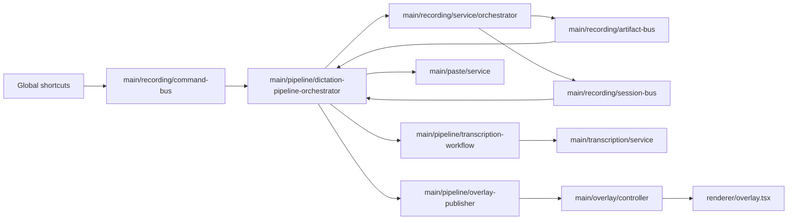

# Dictation Architecture

## Scope

The dictation pipeline subsystem owns end-to-end dictation session lifecycle:

- shortcut command intent gating,
- top-level dictation state machine,
- transcription orchestration handoff,
- post-transcription paste/copy orchestration,
- terminal success/failure reset policy,
- overlay state publication,
- dictation runtime state IPC API.

## High-level data path

## Ownership and responsibilities

- `src/main/pipeline/dictation-pipeline-orchestrator.ts`
  - coordinates top-level dictation flow.
  - subscribes command/session/artifact buses.
  - delegates state mutation and side effects to collaborators.

- `src/main/pipeline/session.ts` (`DictationSessionStateManager`)
  - owns in-memory dictation state and transition-safe mutations.

- `src/main/pipeline/command-intent.ts`
  - maps `(phase, mode, command)` to executable intent.

- `src/main/pipeline/transcription-workflow.ts`
  - executes transcription workflow and artifact persistence outcomes.

- `src/main/paste/service.ts`
  - owns transcript paste/copy post-processing (auto + manual fallback).

- `src/main/pipeline/terminal-policy.ts`
  - determines failed/terminal overlay delay before idle reset.

- `src/main/pipeline/idle-reset-controller.ts`
  - owns single pending idle-reset timer.

- `src/main/pipeline/overlay-publisher.ts`
  - applies immediate phase updates and throttled meter updates.

- `src/main/pipeline/ipc.ts`
  - exposes `dictation:getRuntimeState`.

## Core invariants

1. Recording lifecycle is capture-domain only.
2. Dictation state is the source of truth for overlay state.
3. Post-transcription paste outcomes are represented in dictation failures/phases.
4. Unsupported paste platforms fail early with `paste_not_supported` (no manual-wait fallback).
5. New session start is gated while terminal/transcribing/manual-paste states are active.
