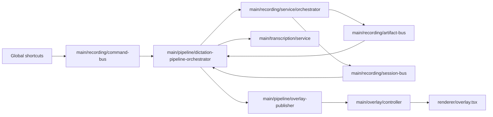

# Dictation Architecture

## Scope

The dictation pipeline subsystem owns end-to-end dictation session lifecycle:

- shortcut command gating,
- top-level session state machine,
- transcription execution,
- terminal success/failure policy,
- overlay publication,
- dictation runtime state API.

## High-level data path

## Ownership and responsibilities

- `src/main/pipeline/dictation-pipeline-orchestrator.ts`
  - coordinates top-level dictation flow and wires event sources.
  - delegates command-policy, state mutation, transcription workflow, and terminal timing to collaborators.
  - enforces single active session (no overlap during transcribing/terminal pre-reset) via command intent rules.

- `src/main/pipeline/session.ts` (`DictationSessionStateManager`)
  - owns dictation in-memory state and transition-safe mutations.
  - provides serialized views for runtime API and overlay payloads.

- `src/main/pipeline/command-intent.ts`
  - pure mapping from `(command + current phase/mode)` to executable intent.
  - central place for shortcut gating policy.

- `src/main/pipeline/transcription-workflow.ts`
  - runs artifact transcription workflow.
  - persists success/failure artifact outcomes and triggers failure cue.

- `src/main/pipeline/terminal-policy.ts`
  - defines terminal-state display durations before idle reset.

- `src/main/pipeline/idle-reset-controller.ts`
  - owns single pending idle-reset timer lifecycle.

- `src/main/pipeline/overlay-publisher.ts`
  - owns overlay publish policy for dictation state.
  - applies immediate phase updates and throttled audio-level updates.

- `src/main/pipeline/ipc.ts`
  - exposes dictation runtime state over IPC (`dictation:getRuntimeState`).

## Core invariants

1. Recording state is capture-domain only.
2. Transcription outcomes are represented only in dictation-domain state.
3. Overlay reflects dictation state, not recording-internal state.
4. A new dictation session cannot start while transcribing or terminal delay is active.
