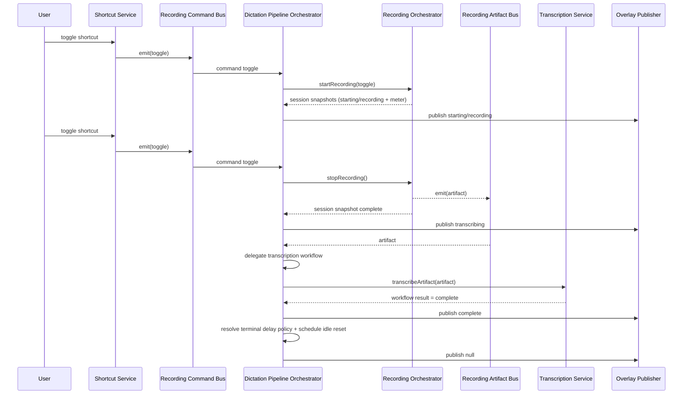
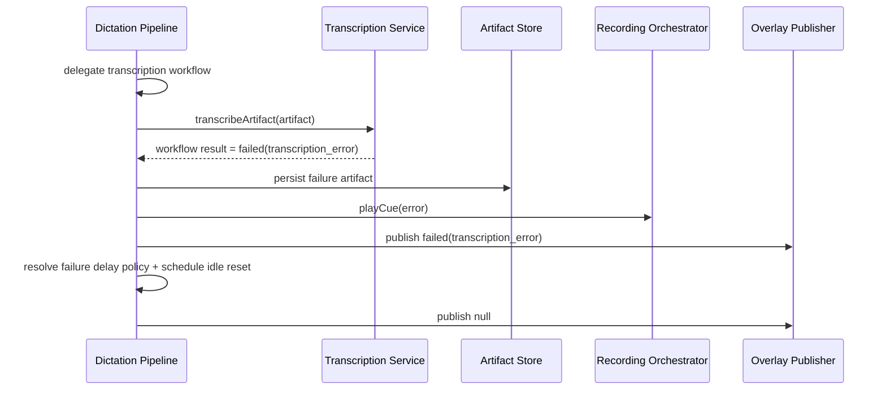

# Dictation Runtime Flows

## 1) Toggle start -> stop -> transcription success

## 2) Transcription failure

## 3) Capture failure

- Recording orchestrator emits failed snapshot with recording-domain reason.
- Dictation pipeline maps it to top-level failed state.
- Dictation terminal timer policy applies, then state resets to idle.

## 4) Single-session gating

- While phase is `transcribing`, `complete`, or `failed` (pre-reset), begin commands are ignored.
- New recording can start only after top-level state returns to `idle`.
