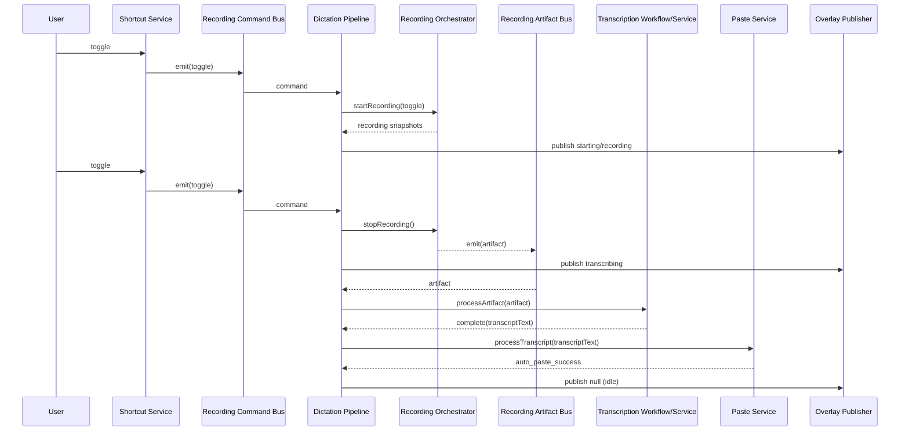

# Dictation Runtime Flows

## 1) Toggle start -> stop -> transcription -> auto-paste success

## 2) Transcription failure

1. artifact is processed by transcription workflow,
2. workflow returns `failed`,
3. dictation transitions to `failed(transcription_error)`,
4. terminal delay policy applies,
5. state resets to idle.

## 3) Auto-paste fallback to manual paste

1. transcription succeeds,
2. paste auto path is skipped/fails,
3. dictation transitions to `awaiting_manual_paste`,
4. overlay gets manual countdown/hint updates,
5. manual session resolves to success/timeout/cancel,
6. pipeline returns to idle for all manual session outcomes.

## 4) Paste hard-fail paths

- unsupported adapter -> `failed(paste_not_supported)`.
- missing accessibility permission -> `failed(paste_permission_denied)`.
- runtime paste error -> `failed(paste_runtime_error)`.

All failed terminal states follow the same delayed reset policy.

## 5) Capture failure

1. recording emits failed snapshot,
2. dictation maps to failed state with capture-domain reason,
3. terminal delay policy runs,
4. idle reset occurs.
