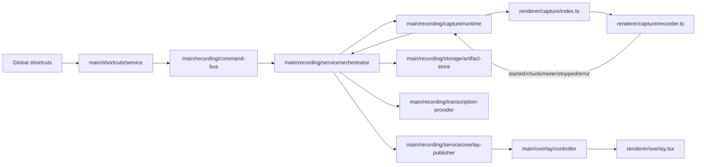

# Recording Architecture

## Scope

The recording subsystem handles:

- global shortcut commands (`toggle`, `cancel`, `push_to_talk_*`),
- audio capture in a hidden renderer runtime,
- live overlay updates,
- artifact persistence and failure retention,
- transcription handoff and terminal state resolution.

## High-level data path

## Ownership and responsibilities

### Main process

- `src/main/shortcuts/service/*`
  - owns shortcut registration, persisted bindings, and PTT runtime integration.
  - emits recording command intents through `recording-events` -> `recording/command-bus`.

- `src/main/recording/service/orchestrator.ts`
  - owns recording lifecycle orchestration.
  - composes dependencies (capture runtime, artifact store, overlay publisher, preferences store, transcription provider).
  - applies terminal-state policy (`complete`/`failed`) and idle reset scheduling.

- `src/main/recording/capture/runtime.ts`
  - owns hidden capture BrowserWindow lifecycle and capture IPC bridge.
  - queues commands before ready handshake and replays FIFO.

- `src/main/recording/storage/artifact-store.ts`
  - owns recording artifact directories and failure metadata persistence.
  - promotes stale active artifacts on startup and cleans expired failures.

- `src/main/overlay/controller/*`
  - owns overlay BrowserWindow lifecycle, display positioning, and macOS visibility policies.

### Preload bridge

- `src/preload/index.ts`
  - exposes stable renderer APIs via `window.api.recording.*`.
  - recording APIs are invoke-based (`getRuntimeState`, `getPreferences`, `updatePreferences`).

### Renderer (capture runtime)

- `src/renderer/src/capture/index.ts`
  - receives capture commands and delegates to recorder operations.

- `src/renderer/src/capture/recorder.ts`
  - owns media stream + MediaRecorder setup/teardown and command handling.
  - emits started/chunks/audio-levels/stopped/error through capture IPC helpers.

- `src/renderer/src/capture/audio-levels.ts`
  - computes live audio level + 20 bars (IPC discriminator remains `meter`).

- `src/renderer/src/capture/audio-cues.ts`
  - plays bundled WAV cues (`start`/`cancel`/`error`) via WebAudio buffers when enabled.
  - prewarms output/context in capture renderer to improve first-play reliability after idle/output switches.

### Renderer (overlay runtime)

- `src/renderer/src/overlay.tsx`
  - receives overlay state and drives bar animation in RAF loop.
  - uses refs + direct style updates to avoid high-frequency React rerenders.

## Core invariants

1. Only one active recording artifact exists at a time.
2. Every session reaches a terminal phase (`complete` or `failed`) before reset to `idle`.
3. IPC channel names in `src/shared/recording.ts` are treated as stable protocol.
4. Overlay phase transitions publish immediately; audio-level updates are throttled/deduped.
