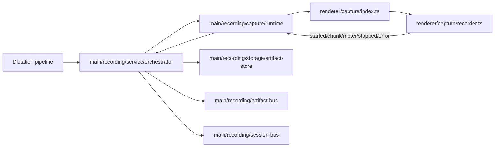

# Recording Architecture

## Scope

The recording subsystem handles capture-domain responsibilities only:

- shortcut command execution requested by a higher-level orchestrator,
- audio capture in a hidden renderer runtime,
- artifact persistence and failure retention,
- capture-level runtime/session snapshots.

It does not own dictation/transcription lifecycle state.

## High-level data path

## Ownership and responsibilities

### Main process

- `src/main/recording/service/orchestrator.ts`
  - owns capture lifecycle transitions (`start`/`stop`/`cancel`).
  - persists capture failures.
  - persists resolved microphone fallback devices reported by capture runtime.
  - emits capture session snapshots to `recordingSessionBus`.
  - emits finalized artifacts to `recordingArtifactBus`.

- `src/main/recording/capture/runtime.ts`
  - owns hidden capture BrowserWindow lifecycle and capture IPC bridge.
  - queues commands before ready handshake and replays FIFO.

- `src/main/recording/storage/artifact-store.ts`
  - owns recording artifact directories and failure metadata persistence.
  - promotes stale active artifacts on startup and cleans expired failures.

### Preload bridge

- `src/preload/index.ts`
  - exposes `window.api.recording.*` for recording preferences.

### Renderer (capture runtime)

- `src/renderer/src/capture/index.ts`
  - receives capture commands and delegates to recorder operations.

- `src/renderer/src/capture/recorder.ts`
  - owns media stream + MediaRecorder setup/teardown and command handling.
  - resolves preferred microphone device with fallback to first available input.
  - emits started/chunks/audio-levels/stopped/error through capture IPC helpers.
  - emits resolved microphone device ids for main-process persistence.

## Core invariants

1. Only one active recording artifact exists at a time.
2. Recording subsystem never applies transcription outcomes as recording machine state.
3. Finalized artifacts are handed off via `recordingArtifactBus` for downstream dictation processing.
