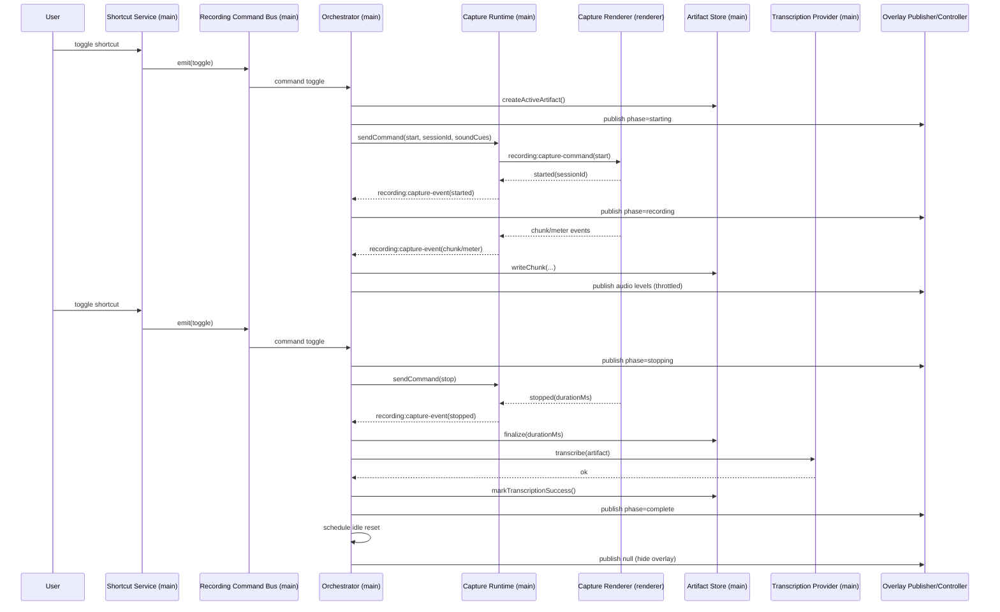
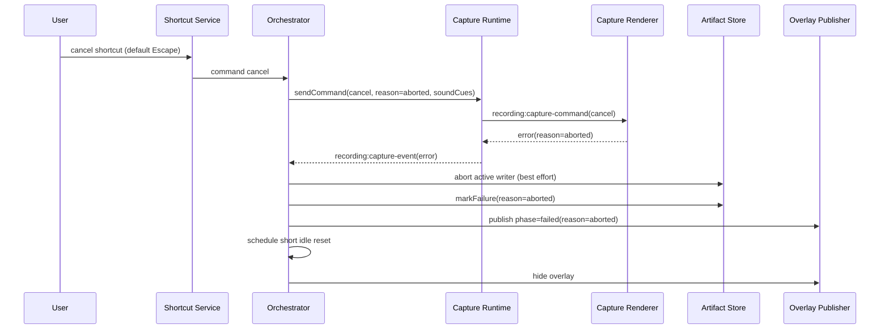
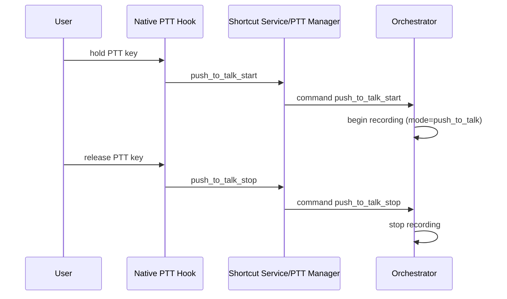

# Recording Runtime Flows

## 1) Toggle start -> stop -> transcription success

## 2) Cancel during starting/recording/stopping

## 3) Push-to-talk hold/release

## 4) Capture/transcription failure behavior

- Any capture write/finalize/runtime error maps to `capture_error` unless explicit `aborted`.
- Thrown transcription exceptions are normalized to `transcription_error`.
- Artifact failure metadata is persisted on failure paths (best effort).
- Terminal failed state is always published before idle reset.

## 5) App shutdown during active recording

1. `before-quit` triggers graceful shutdown sequence.
2. `shutdownRecording()` is awaited with timeout (`2500ms`).
3. Active artifact is aborted and persisted as failed (`aborted`, message `Application shutdown.`).
4. Overlay/capture runtimes are destroyed.
5. App continues quit even if timeout path is reached.
