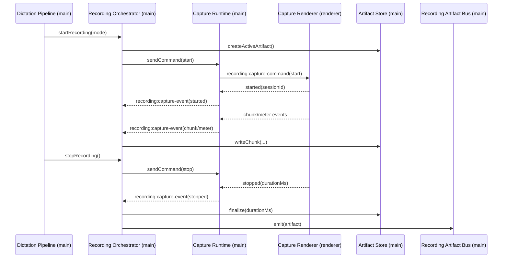
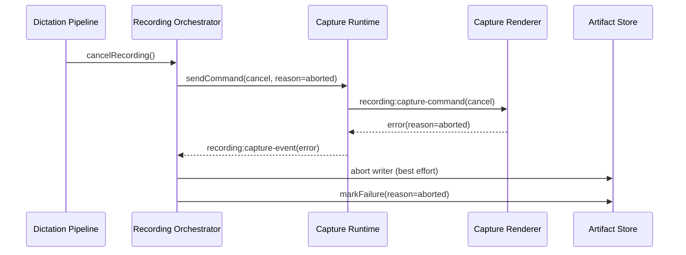

# Recording Runtime Flows

## 1) Start -> stop -> artifact handoff

## 2) Cancel during active capture

## 3) Capture failure behavior

- Any capture write/finalize/runtime error maps to `capture_error` unless explicit `aborted`.
- Failure artifact metadata is persisted on capture failure paths (best effort).
- Recording state snapshots are emitted for pipeline consumers.

## 4) App shutdown during active recording

1. Shutdown aborts any active writer.
2. Active artifact is persisted as failed (`aborted`, `Application shutdown.`).
3. Capture runtime is torn down.
