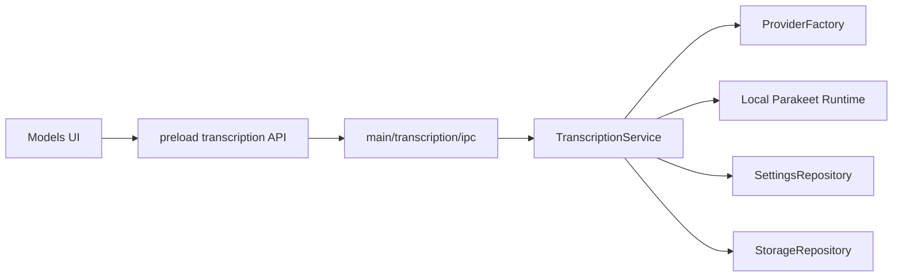

# Transcription Architecture

## Scope

The transcription subsystem owns:

- provider selection/configuration,
- cloud API credential persistence,
- local model lifecycle (download/delete/status),
- local runtime lifecycle (start/stop/status),
- artifact transcription execution,
- transcript/session persistence after success.

## Main Components

- `src/main/transcription/service/index.ts` (`TranscriptionService`)
  - orchestration facade for preferences, credentials, local runtime/model actions, and artifact transcription.

- `src/main/transcription/provider-factory.ts`
  - provider selection and configuration gating.
  - maps provider/runtime failures to stable `TranscriptionFailureCode` values.

- `src/main/transcription/local/parakeet/*`
  - local model manager + runtime discovery + websocket runtime client for local transcription.

- `src/main/transcription/ipc.ts`
  - transcription/local-model IPC registration and download progress event emission.

## Persistence Boundaries

Transcription uses repositories/stores with clear boundaries:

- preferences + cloud credential payloads -> `SettingsRepository` (`app_settings`),
- transcript/session writes -> `StorageRepository` (`sessions`, `transcripts`).

## Models Surface (Renderer)

Models routing and UI:

- `/models` redirects to `/models/local`.
- tab order in layout is `Local | Cloud`.

Relevant files:

- `src/renderer/src/routes/models/index.tsx` (default redirect),
- `src/renderer/src/views/models/index.tsx` (tab order + switching),
- `src/renderer/src/views/models/local.tsx`,
- `src/renderer/src/views/models/cloud.tsx`.

## High-level Flow

